# Digital Heroes Golf Platform

A full-stack implementation of the **Digital Heroes 2026 Level 1** golf, charity and monthly draw platform, built as a **trainee selection / sample assignment**.

The project combines subscription-oriented access control, golf score management, charity contributions, deterministic draw simulation, winner verification and an admin operations panel.

---

## 1. Project at a Glance

| Area | Implementation |
|---|---|
| Frontend | Next.js + React + TypeScript + Tailwind CSS |
| Authentication | Supabase Auth |
| Database | Supabase PostgreSQL |
| File storage | Supabase Storage |
| Payments | Stripe Checkout + webhook integration |
| Access control | Subscriber/admin role guards + PostgreSQL RLS |
| Golf scoring | Stableford score validation (1–45) |
| Score rule | Latest 5 submitted scores |
| Draw engine | Random + score-frequency weighted modes |
| Prize model | 40% / 35% / 25% + 5-match jackpot rollover |
| Charity | Directory, selection and contribution percentage |
| Winner flow | Proof upload → admin verification → payout state |
| Testing | Vitest + GitHub Actions build/test verification |
| Deployment | Vercel + Supabase, with Render staging |

---

## 2. Demo Credentials

> These credentials are **demo/test credentials for the trainee selection assignment only**. Do not reuse them for a real production account.

### Demo User

- **Email:** `demo.user@digitalheroes.test`
- **Password:** `12345678`
- **Role:** Subscriber
- **Plan fixture:** Monthly / Active
- **Demo data:** 5 golf scores + charity preference

### Demo Admin

- **Email:** `demo.admin@digitalheroes.test`
- **Password:** `12345678`
- **Role:** Admin

### Main Demo URLs

- **Vercel:** https://golf-platform-six.vercel.app/
- **Render staging:** https://digital-heroes-golf-platform-8l0d.onrender.com/
- **Repository:** https://github.com/affanSkhan/golf-platform

Recommended walkthrough:

`Home → Login → Dashboard → Scores → Charity → Draw/Impact → Admin`

---

# 3. System Architecture

The platform is intentionally split into a presentation layer, application/API layer, managed backend services and deterministic domain logic.

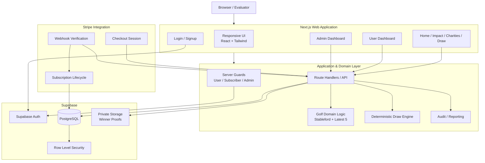

### Architectural principles

1. **Server-side authorization first**  
   Authentication and role checks are performed before protected operations.

2. **Database-level enforcement**  
   Supabase RLS is used as a second security boundary, not just UI-level hiding.

3. **Domain logic is isolated**  
   Golf score rules and draw mathematics live outside UI components, which makes them testable and auditable.

4. **Payments are event-driven**  
   Stripe webhook events update subscription state instead of trusting only the client-side checkout result.

5. **Draws are reproducible**  
   The draw engine supports deterministic seeded simulations, making the algorithm easier to test and demonstrate.

---

# 4. Core User Journey

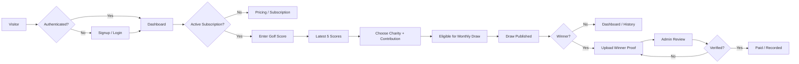

---

# 5. Subscription & Access Architecture

The PRD defines monthly/yearly plans, subscription lifecycle handling and subscriber-only access.

The implementation contains the payment integration boundary and subscription state model, while this trainee environment intentionally does **not** expose live payment credentials.

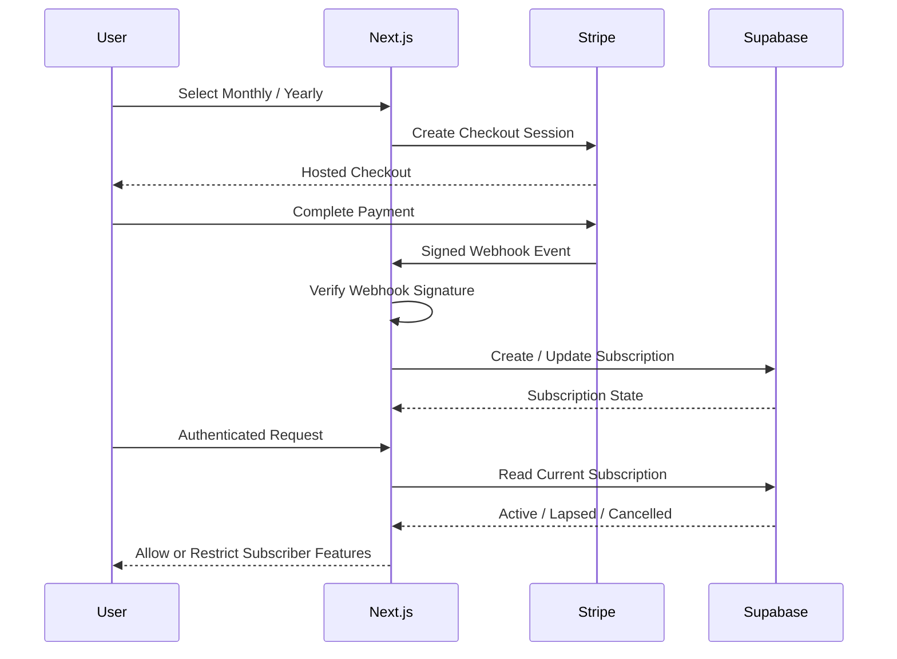

### Payment status in this submission

- Stripe SDK and checkout route are implemented.
- Stripe webhook handling is implemented.
- Subscription lifecycle fields are stored in Supabase.
- The demo subscriber is backed by a **test fixture in Supabase**, not a real-money payment.
- Stripe production/test secrets are intentionally not included in the repository or demo environment.

This keeps the assignment demonstrable without exposing payment credentials.

---

# 6. Golf Score Domain

### Stableford validation

The application validates scores in the required **1–45** range.

### Rolling score rule

The user can store historical scores, while draw eligibility uses the **latest five scores**.

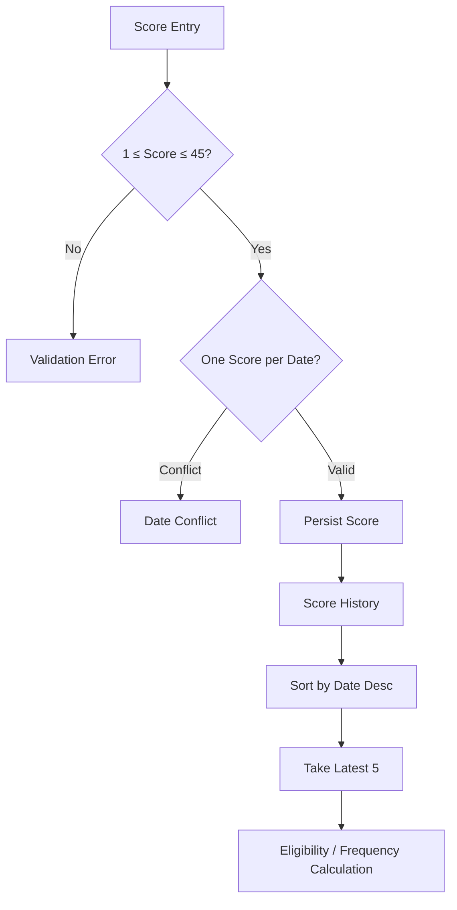

---

# 7. Monthly Draw Engine

The draw subsystem supports the two mechanisms described in the assignment:

- **Random draw**
- **Score-frequency weighted algorithmic draw**

The engine also supports deterministic seeds for reproducible simulations.

### Prize allocation

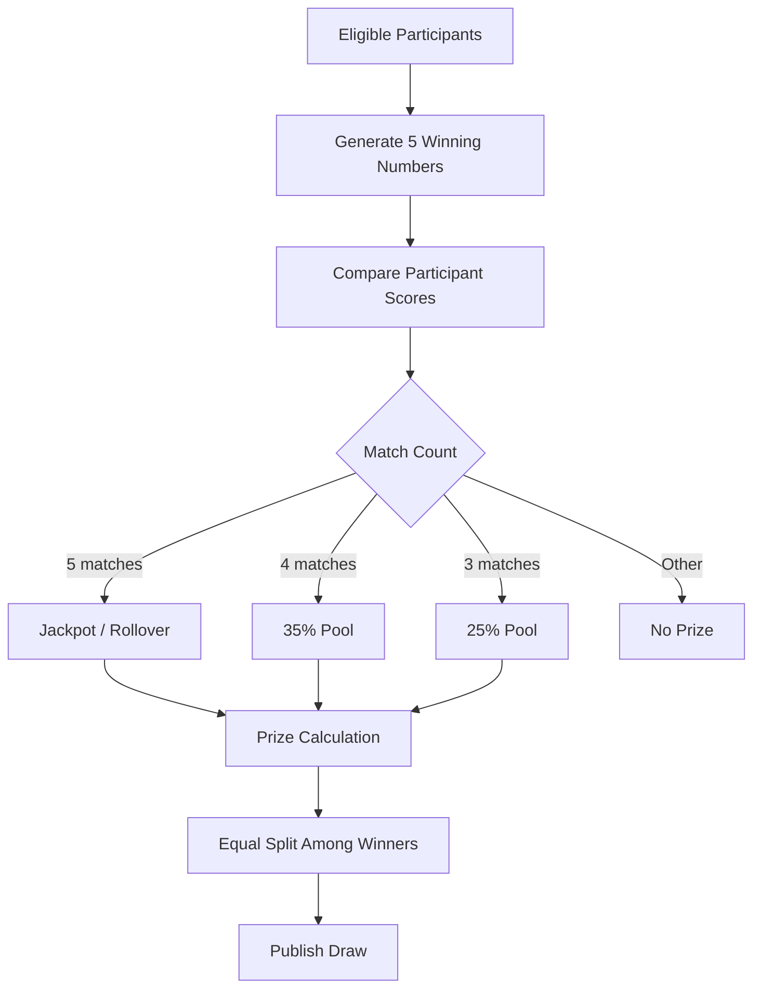

### Draw lifecycle

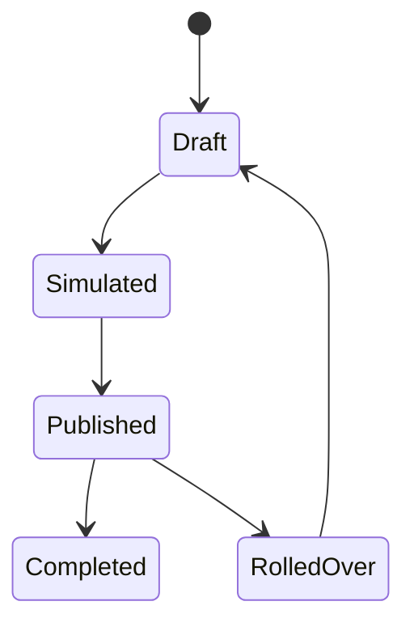

The admin workflow is designed around:

`Create → Simulate → Review → Publish → Allocate → Verify Winners`

---

# 8. Charity Contribution Model

Users can select a charity and define a contribution percentage.

The implemented model enforces a **10% minimum** contribution.

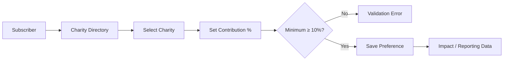

The initial Supabase seed contains six charities for the demo environment.

---

# 9. Winner Verification

Winner proof files are designed to live in a **private Supabase Storage bucket**.

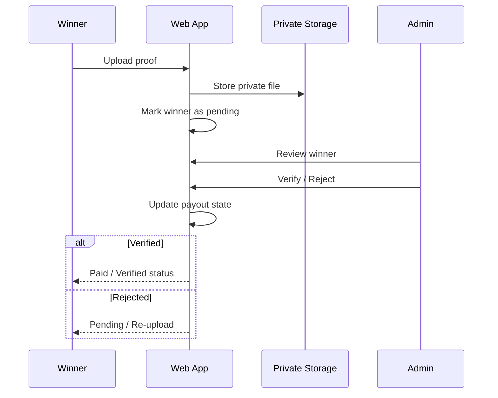

---

# 10. Security Model

Security is enforced in multiple layers.

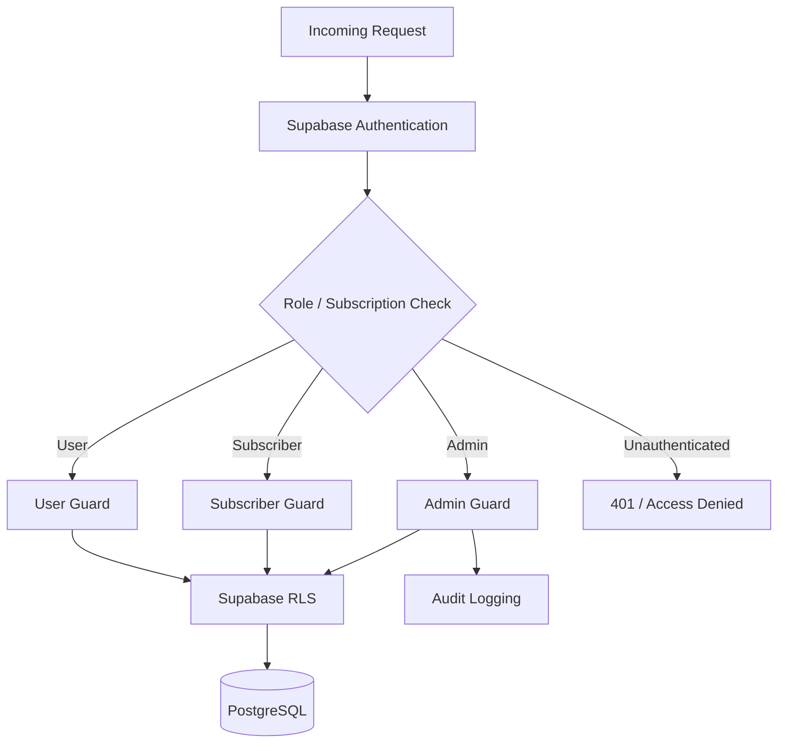

### Security controls

- Supabase Auth for identity
- Server-side route protection
- Subscriber/admin role boundaries
- PostgreSQL Row Level Security
- Private winner-proof storage
- Stripe webhook signature verification
- No payment secrets committed to Git
- Validation before database writes
- Domain-level tests for draw/scoring rules

---

# 11. Data Model

High-level relational structure:

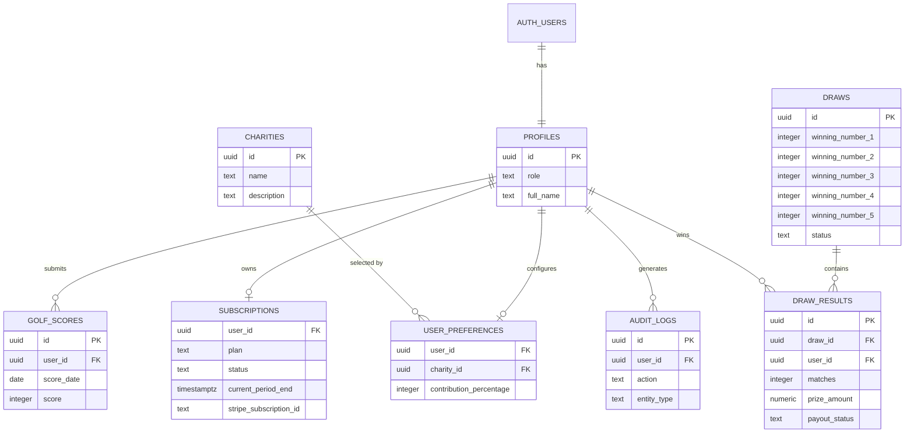

---

# 12. Main Application Modules

```
app/
├── public pages
│   ├── /
│   ├── /pricing
│   ├── /charities
│   ├── /draw
│   └── /impact
│
├── authentication
│   ├── /login
│   └── /signup
│
├── subscriber experience
│   └── /dashboard
│
├── administration
│   └── /admin
│
└── API routes
    ├── /api/scores
    ├── /api/preferences
    ├── /api/charities
    ├── /api/dashboard
    ├── /api/checkout
    ├── /api/webhooks/stripe
    ├── /api/draw/simulate
    ├── /api/admin/users
    ├── /api/admin/draws
    ├── /api/admin/draws/publish
    ├── /api/admin/winners
    └── /api/health

lib/
├── domain.ts
├── draw.ts
├── server-guards.ts
└── supabase/

supabase/
└── migrations/

tests/
├── domain.test.ts
└── draw.test.ts
```

---

# 13. Key Backend Responsibilities

| Module | Responsibility |
|---|---|
| `lib/server-guards.ts` | Current user, required user, active subscriber and admin checks |
| `lib/domain.ts` | Score validation and rolling-five domain rules |
| `lib/draw.ts` | Random/frequency-weighted draw generation and prize allocation |
| Supabase Auth | Identity and sessions |
| PostgreSQL | Users, subscriptions, scores, charities, draws, winners and audit data |
| Supabase RLS | Database-level authorization |
| Stripe routes | Checkout creation and subscription webhook processing |
| Storage | Private winner proof files |
| Vitest | Automated domain and draw verification |

---

# 14. Testing & Quality

The repository includes automated tests for the most calculation-sensitive parts of the application.

### Current unit coverage

- Stableford score boundaries: **1–45**
- Latest-five score selection
- Five unique draw numbers
- Deterministic seeded draws
- Frequency-weighted drawing
- 40% / 35% / 25% prize allocation
- Jackpot rollover behavior
- Equal splitting of prize amounts
- 3+ match winner detection

### CI

GitHub Actions verifies:

```text
npm install
   ↓
npm test
   ↓
npm run build
   ↓
✅ Submission build verified
```

---

# 15. Deployment Architecture

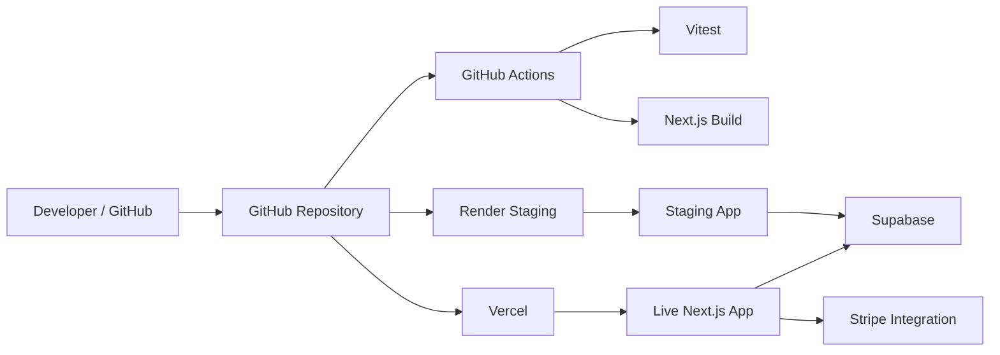

### Current infrastructure

**Vercel**
- Project: `golf-platform`
- Live URL: https://golf-platform-six.vercel.app/

**Render**
- Staging URL: https://digital-heroes-golf-platform-8l0d.onrender.com/

**Supabase**
- Project: `digital-heroes-golf-platform`
- Region: `ap-south-1`
- Project ref: `pgvopyvtumjzljqhsngl`

---

# 16. Environment Configuration

The repository includes `.env.example`:

```env
NEXT_PUBLIC_SUPABASE_URL=
NEXT_PUBLIC_SUPABASE_PUBLISHABLE_KEY=

STRIPE_SECRET_KEY=
STRIPE_WEBHOOK_SECRET=
STRIPE_MONTHLY_PRICE_ID=
STRIPE_YEARLY_PRICE_ID=

NEXT_PUBLIC_APP_URL=
```

### Important

Do **not** commit secrets to GitHub.

For this trainee submission:

- Supabase database/auth/storage are configured for the demo environment.
- Stripe integration is implemented but payment secrets are intentionally omitted.
- The demo subscriber's active subscription is a test fixture used to demonstrate protected dashboard functionality.

---

# 17. Admin Capabilities

The admin panel provides the main operational surfaces required by the assignment:

### Users
- Inspect registered users
- View role/subscription context
- Manage user-facing operational data

### Draws
- Prepare draw inputs
- Simulate draw outcomes
- Review results before publishing
- Publish monthly results

### Charities
- View/manage charity records

### Winners
- Review winning participants
- Review proof state
- Move the verification/payout workflow forward

### Reporting
- Summary/reporting endpoints and UI surfaces for operational visibility

---

# 18. Demonstration Data

The demo environment includes:

- 2 application users
- 1 admin account
- 1 subscriber account
- 1 active monthly subscription test fixture
- 5 golf scores for the demo subscriber
- 6 seeded charities
- A selected charity preference with a 10% contribution

This lets an evaluator demonstrate the end-to-end user and admin flows without needing to create all data from scratch.

---

# 19. Suggested Evaluator Walkthrough

### A. Public experience

1. Open the home page.
2. Review the impact, charity and draw sections.
3. Open pricing and compare monthly/yearly plans.
4. Check responsive behavior.

### B. Subscriber experience

1. Login with the demo subscriber.
2. Open the dashboard.
3. Add/edit/delete a score.
4. Confirm only the latest five are considered.
5. Select a charity and contribution percentage.
6. Review draw/impact information.

### C. Admin experience

1. Login with the demo admin.
2. Inspect users.
3. Open draw management.
4. Run a draw simulation.
5. Review prize allocation.
6. Inspect charities and winner operations.

### D. Engineering review

1. Inspect `lib/domain.ts`.
2. Inspect `lib/draw.ts`.
3. Inspect `lib/server-guards.ts`.
4. Review Supabase migrations and RLS.
5. Run `npm test`.
6. Run `npm run build`.

---

# 20. Design & UX

The UI is designed around the assignment's golf + impact concept rather than treating the product as a generic admin CRUD application.

Key UX goals:

- Clear primary CTA and conversion path
- Mobile-first responsive layouts
- Dashboard-first subscriber experience
- Distinct admin operational surfaces
- Charity and impact content visible alongside functionality
- Draw concepts presented visually
- Clear loading, error and empty states
- Minimal dependency on unnecessary UI libraries

---

# 21. Submission Status

### Implemented

- ✅ Responsive public website
- ✅ Signup/login
- ✅ Role-aware subscriber/admin experience
- ✅ Supabase database + RLS
- ✅ Stableford validation
- ✅ Latest-five score logic
- ✅ Charity directory + contribution preference
- ✅ Random draw mode
- ✅ Frequency-weighted draw mode
- ✅ Deterministic simulation
- ✅ 40/35/25 prize structure
- ✅ 5-match jackpot rollover
- ✅ Equal prize splitting
- ✅ Winner proof workflow
- ✅ Admin management surfaces
- ✅ Audit-log-ready schema
- ✅ Automated tests
- ✅ GitHub Actions verification
- ✅ Vercel + Supabase deployment

### Payment note

- ✅ Stripe checkout/webhook architecture implemented
- ✅ Subscription lifecycle model implemented
- ⏳ Real Stripe payment credentials intentionally not enabled for this trainee/demo environment

This is a deliberate submission-environment decision, not a removal of the payment architecture.

---

# 22. License / Assignment Context

This repository was prepared as a **Digital Heroes Level 1 trainee selection sample assignment**.

It is structured to demonstrate:

- requirements interpretation
- full-stack architecture
- secure data handling
- algorithmic problem solving
- role-based access control
- database design
- responsive UI/UX
- testing and deployment discipline

For evaluator convenience, the repository contains demo credentials above and seeded sample data.

---

## Quick Start

```bash
git clone https://github.com/affanSkhan/golf-platform.git
cd golf-platform
npm install
npm run dev
```

Then open:

`http://localhost:3000`

Configure the values from `.env.example` for local development.

---

## Final Architecture Summary

```
                         ┌─────────────────────┐
                         │      Browser        │
                         │ User / Admin / Demo  │
                         └──────────┬──────────┘
                                    │
                                    ▼
                         ┌─────────────────────┐
                         │     Next.js App     │
                         │ UI + API + Guards   │
                         └──────┬───────┬──────┘
                                │       │
                 ┌──────────────┘       └──────────────┐
                 ▼                                     ▼
       ┌──────────────────┐                  ┌──────────────────┐
       │ Supabase         │                  │ Stripe           │
       │ Auth / Postgres  │                  │ Checkout / Hooks │
       │ RLS / Storage    │                  │ Subscription     │
       └────────┬─────────┘                  └────────┬─────────┘
                │                                     │
                └──────────────────┬──────────────────┘
                                   ▼
                         ┌─────────────────────┐
                         │ Domain Logic        │
                         │ Scores / Draw /     │
                         │ Prize / Eligibility│
                         └─────────────────────┘
                                   │
                                   ▼
                         ┌─────────────────────┐
                         │ Tested + Auditable  │
                         │ GitHub Actions      │
                         └─────────────────────┘
```

**Digital Heroes Golf Platform — full-stack, database-backed, role-aware and testable sample implementation.**
